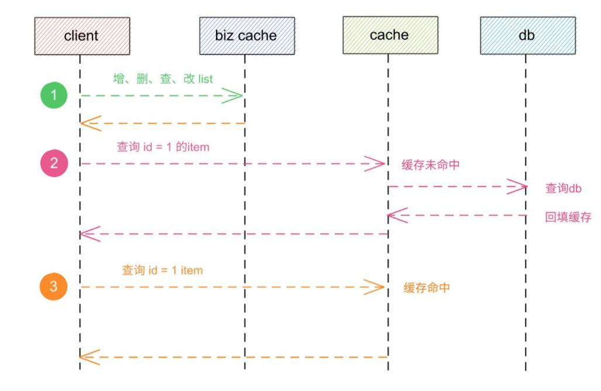

[TOC]
# 1 架构图
缩短从需求到上线的距离
go-zero 是一个集成了各种工程实践的 web 和 rpc 框架。通过弹性设计保障了大并发服务端的稳定性，经受了充分的实战检验。

go-zero 包含极简的 API 定义和生成工具 goctl，可以根据定义的 api 文件一键生成 Go, iOS, Android, Kotlin, Dart, TypeScript, JavaScript 代码，并可直接运行。

使用 go-zero 的好处：

轻松获得支撑千万日活服务的稳定性
内建级联超时控制、限流、自适应熔断、自适应降载等微服务治理能力，无需配置和额外代码
微服务治理中间件可无缝集成到其它现有框架使用
极简的 API 描述，一键生成各端代码
自动校验客户端请求参数合法性
大量微服务治理和并发工具包


# 2 单体服务
## 2.1 快速生成一个服务
```shell
$ mkdir go-zero-demo
$ cd go-zero-demo
$ go mod init go-zero-demo
$ goctl api new greet
$ go mod tidy
Done.
```
查看一下greet服务的目录结构

```shell
$ tree greet
.
├── etc
│   └── greet-api.yaml              // 配置文件
├── go.mod                          // mod文件
├── greet.api                       // api描述文件
├── greet.go                        // main函数入口
└── internal                        
    ├── config  
    │   └── config.go               // 配置声明type
    ├── handler                     // 路由及handler转发
    │   ├── greethandler.go
    │   └── routes.go
    ├── logic                       // 业务逻辑
    │   └── greetlogic.go
    ├── middleware                  // 中间件文件
    │   └── greetmiddleware.go
    ├── svc                         // logic所依赖的资源池
    │   └── servicecontext.go
    └── types                       // request、response的struct，根据api自动生成，不建议编辑
        └── types.go
```
## 2.2 复杂一点的单体服务
复杂一点的单体服务,主要区别还是在api文件的定义上,可以通过划分多个api文件

```go

type (
    addCartItemReq struct {
        ProductId int64 `json:"productId"`
        ProductSkuId int64 `json:"productSkuId"`
        MemberId int64 `json:"memberId"`
        Quantity int64 `json:"quantity"`                   // 购买数量
        Price float64 `json:"price"`                       // 添加到购物车的价格
        ProductPic string `json:"productPic"`              // 商品主图
        ProductName string `json:"productName"`            // 商品名称
        ProductSubTitle string `json:"productSubTitle"`    // 商品副标题（卖点）
        ProductSkuCode string `json:"productSkuCode"`      // 商品sku条码
        MemberNickname string `json:"memberNickName"`      // 会员昵称
        DeleteStatus int64 `json:"deleteStatus"`           // 是否删除
        ProductCategoryId int64 `json:"productCategoryId"` // 商品分类
        ProductBrand string `json:"productBrand"`
        ProductSn string `json:"productSn"`
        ProductAttr string `json:"productAttr"`            // 商品销售属性:[{"key":"颜色","value":"颜色"},{"key":"容量","value":"4G"}]
    }
    addCartItemResp struct {
        Code string `json:"code"`
        Message string `json:"message"`
    }
)
@server(
    jwt: Auth
    middleware: CheckUrl
    group: order/cart
    prefix: /api/order/cart
)
service admin-api {
    @doc "CartItemAdd"
    @handler CartItemAdd
    post /add (addCartItemReq) returns (addCartItemResp)
}
```

分类编写api文件,最终在一个文件里面引用
```shell
doc
├── admin.api
├── oms
│   ├── cart_item.api
│   ├── order.api
│   ├── order_company_address.api
│   ├── order_operate_history.api
│   ├── order_return_apply.api
│   ├── order_return_reason.api
│   └── order_setting.api
├── pms
│   ├── product.api
│   ├── product_brand.api
│   ├── product_category.api
│   ├── product_comment.api
│   ├── product_feight_template.api
│   ├── product_member_price.api
│   └── product_sku_stock.api

```
## 2.3 api文件编写注意
api文件的几个注意点:
- 1.service标签的名称必须是同一个,因为是标识一个服务
- 2.struct不能同名,即使是在不同的api文件里面,因为最终会汇聚到types.go文件里去
- 3.@server标签里的group是指将自动生成的文件归类到不同的group(即文件夹),prefix才是url的前缀
- 4.service标签里在handle前面增加@doc,可以通过goctl生成接口文档 `goctl.exe api doc -dir user.api -o ./`


# 3 rpc
api部分其实和单体服务的创建逻辑是一样的，只是在单体服务中没有服务间的通讯而已， 且微服务中api服务会多一些rpc调用的配置
假设我们在开发一个商城项目，而开发者小明负责用户模块(user)和订单模块(order)的开发，我们姑且将这两个模块拆分成两个微服务
订单服务(order)提供一个查询接口
用户服务(user)提供一个方法供订单服务获取用户信息
```shell
├── order
│   └── api
│       ├── etc
│       │   └── order.yaml
│       ├── internal
│       │   ├── config
│       │   │   └── config.go
│       │   ├── handler
│       │   │   ├── getorderhandler.go
│       │   │   └── routes.go
│       │   ├── logic
│       │   │   └── getorderlogic.go
│       │   ├── svc
│       │   │   └── servicecontext.go
│       │   └── types
│       │       └── types.go
│       ├── order.api
│       └── order.go
└── user
    └── rpc
        ├── etc
        │   └── user.yaml
        ├── internal
        │   ├── config
        │   │   └── config.go
        │   ├── logic
        │   │   └── getuserlogic.go
        │   ├── server
        │   │   └── userserver.go
        │   └── svc
        │       └── servicecontext.go
        ├── user
        │   └── user.pb.go
        ├── userclient
        │   └── user.go
        ├── user.go
        └── user.proto

```

## 3.1 编写proto文件
```protobuf
syntax = "proto3";

package user;

message IdRequest {
    string id = 1;
}

message UserResponse {
    // 用户id
    string id = 1;
    // 用户名称
    string name = 2;
    // 用户性别
    string gender = 3;
}

service User {
    rpc getUser(IdRequest) returns(UserResponse);
}
```

## 3.2 生成代码
`goctl rpc protoc user.proto --go_out=./types --go-grpc_out=./types --zrpc_out=.`

## 3.3 编写业务逻辑
在对应的logic文件中
```go
func (l *GetUserLogic) GetUser(in *user.IdRequest) (*user.UserResponse, error) {
    return &user.UserResponse{
            Id:   "1",
            Name: "test",
    }, nil
}
```

## 3.4 rpc深入


# 4 数据库model文件

- 1.方式一(ddl)
进入service/user/model目录，执行命令

```shell
$ cd service/user/model
$ goctl model mysql ddl -src user.sql -dir . -c
Done.
```
- 2.方式二(datasource)

```shell
$ goctl model mysql datasource -url="$datasource" -table="user" -c -dir .
Done.
```

执行命令后会自动生成对应的接口函数,这里如果觉得生成的逻辑不太合适的话就可以自己修改模板
```go
	userModel interface {
		Insert(ctx context.Context, data *User) (sql.Result, error)
		FindOne(ctx context.Context, id int64) (*User, error)
		FindOneByNumber(ctx context.Context, number string) (*User, error)
		Update(ctx context.Context, data *User) error
		Delete(ctx context.Context, id int64) error
	}
```
目前只支持 mysql,postgre和mongo三种数据库

# 4 模板
go-zero主要模式还是通过编写api文件和proto文件,借用模板文件进行代码生成,有些时候对模板的定制还是比较重要的
生成最新的template文件到指定文件夹, 要使用自己的模板的话,在相应的命令后面指定 -home参数即可
`goctl template init --home ./template`
```
├─api
├─docker
├─kube
├─model
├─mongo
├─newapi
└─rpc
```

# 5 goctl
goctl是go-zero微服务框架下的代码生成工具。使用 goctl 可显著提升开发效率，让开发人员将时间重点放在业务开发上，其功能有：

api服务生成
rpc服务生成
model代码生成
模板管理

其他命令
goctl docker 可以极速生成一个 Dockerfile，帮助开发/运维人员加快部署节奏，降低部署复杂度。
```shell
$ goctl docker -go hello.go
$ docker build -t hello:v1 -f service/hello/Dockerfile .
```
goctl kube提供了快速生成一个 k8s 部署文件的功能，可以加快开发/运维人员的部署进度，减少部署复杂度。

```shell
$ goctl kube deploy -name redis -namespace adhoc -image redis:6-alpine -o redis.yaml -port 6379

$ kubectl run -i --tty --rm cli --image=redis:6-alpine -n adhoc -- sh
```
# 6 组件深入

# 6.1 高并发和高可用
通过中间件注入的方式,将trace,log,数据监控,并发数控制,熔断,降载,超时等等功能加进去
```go
func (ng *engine) bindRoute(fr featuredRoutes, router httpx.Router, metrics *stat.Metrics,
	route Route, verifier func(chain alice.Chain) alice.Chain) error {
	chain := alice.New(
		handler.TracingHandler(ng.conf.Name, route.Path),
		ng.getLogHandler(),
		handler.PrometheusHandler(route.Path),
		handler.MaxConns(ng.conf.MaxConns),
		handler.BreakerHandler(route.Method, route.Path, metrics),
		handler.SheddingHandler(ng.getShedder(fr.priority), metrics),
		handler.TimeoutHandler(ng.checkedTimeout(fr.timeout)),
		handler.RecoverHandler,
		handler.MetricHandler(metrics),
		handler.MaxBytesHandler(ng.checkedMaxBytes(fr.maxBytes)),
		handler.GunzipHandler,
	)
	chain = ng.appendAuthHandler(fr, chain, verifier)

	for _, middleware := range ng.middlewares {
		chain = chain.Append(convertMiddleware(middleware))
	}
	handle := chain.ThenFunc(route.Handler)

	return router.Handle(route.Method, route.Path, handle)
}
```

# 6.2 缓存管理

# 6.2.1 更新db,删除缓存(不更新)
- 1.想要提高应用的性能，可以引入「缓存」来解决

- 2.引入缓存后，需要考虑缓存和数据库一致性问题，可选的方案有：「更新数据库 + 更新缓存」、「更新数据库 + 删除缓存」

- 3.更新数据库 + 更新缓存方案，在「并发」场景下无法保证缓存和数据一致性，且存在「缓存资源浪费」和「机器性能浪费」的情况发生

- 4.在更新数据库 + 删除缓存的方案中，「先删除缓存，再更新数据库」在「并发」场景下依旧有数据不一致问题，解决方案是「延迟双删」，但这个延迟时间很难评估，所以推荐用「先更新数据库，再删除缓存」的方案

- 5.在「先更新数据库，再删除缓存」方案下，为了保证两步都成功执行，需配合「消息队列」或「订阅变更日志」的方案来做，本质是通过「重试」的方式保证数据一致性

- 6.在「先更新数据库，再删除缓存」方案下，「读写分离 + 主从库延迟」也会导致缓存和数据库不一致，缓解此问题的方案是「延迟双删」，凭借经验发送「延迟消息」到队列中，延迟删除缓存，同时也要控制主从库延迟，尽可能降低不一致发生的概率

# 6.2.2 缓存自动管理

# 6.2.2.1 单行缓存管理
- 基于主键的缓存
- 基于唯一索引的缓存
- 基于组合唯一索引的缓存
分类

查询流程

查询流程

查询流程


# 6.2.2.2 多行缓存管理
分类

查询流程



